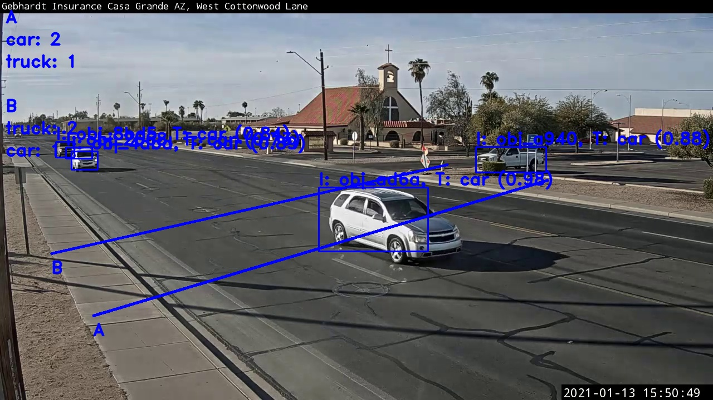

# Traffic and Weather dashboard
This dashbaord is an open-source video-based object counting software for tallying weather and traffic information from live video streams from Youtube



# Raw data
The data dashboard for all data collected from traffic and weather can be found here: [Mongodb Dashboard](https://charts.mongodb.com/charts-project-0-wlibw/public/dashboards/5ff7d266-6fa8-43b5-8532-45e3047c4622)

## Requirements
- Python 3 (tested with versions 3.5, 3.6 and 3.7)

## Setup
- Clone this repo `git@github.com:MedadRufus/ivy.git`.
- Create and/or use a virtual environment (optional but recommended).
- Install the dependencies in _requirements.txt_ `pip install -r requirements.txt`.
- Choose a detector and install its dependencies where necessary (if you're not sure what to pick, we recommend you start with `yolo`).

| Detector | Description | Dependencies |
|---|---|---|
| `yolo` | Perform detection using models created with the YOLO (You Only Look Once) neural net. https://pjreddie.com/darknet/yolo/ | |
| `tfoda` | Perform detection using models created with the Tensorflow Object Detection API. https://github.com/tensorflow/models/tree/master/research/object_detection | CPU: `pip install tensorflow-cpu` <br> GPU: `pip install tensorflow-gpu` |
| `detectron2` | Perform detection using models created with FAIR's Detectron2 framework. https://github.com/facebookresearch/detectron2 | `python -m pip install 'git+https://github.com/facebookresearch/detectron2.git'` (https://github.com/facebookresearch/detectron2/blob/master/INSTALL.md) |
| `haarcascade` | Perform detection using Haar feature-based cascade classifiers. https://docs.opencv.org/3.4/db/d28/tutorial_cascade_classifier.html | |

## Run
- Create a _.env_ file (based on _.env.example_) in the project's root directory and edit as appropriate.
- Run `python -m  main`.

## Demo
Download [ivy_demo_data.zip](https://drive.google.com/open?id=1JtEhWlfk1CiUEFsrTQHQa0VkTi3IKbze) and unzip its contents in the [data directory](/data). It contains detection models and a sample video.

## Test
```
python -m pytest
```

## Debug
By default, Ivy runs in "debug mode" which provides you a window to monitor the object counting process. You can:
- press the `p` key to pause/play the counting process
- press the `s` key to capture a screenshot
- press the `q` key to quit the program
- click any point on the window to log the coordinates of the pixel in that position


